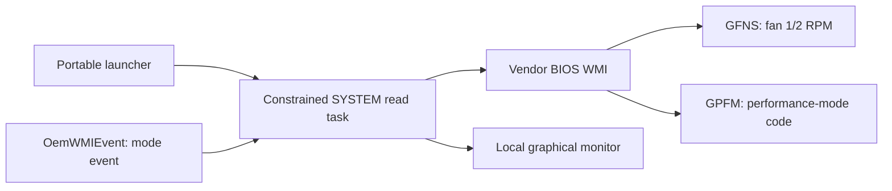

<div align="center">
  
  <h1>MECHREVO WUJIE 14 2026 Fan Monitor</h1>
  <p>A read-only fan RPM and firmware performance-mode monitor</p>
  <p><a href="README.md">简体中文</a> · <strong>English</strong></p>
  <p>
    <a href="https://github.com/zsr71/Mechrevo-Wujie14-2026-Fan-Monitor/releases"></a>
    <a href="LICENSE"></a>
    
    
  </p>
</div>

<p align="center">
  
</p>

This project reads actual dual-fan RPM and the current firmware performance-mode code on the MECHREVO WUJIE 14 2026 through the vendor BIOS WMI interface. It installs no EC-access driver and changes no fan or performance setting.

> [!IMPORTANT]
> The current release is a **read-only monitor**, not a fan controller. It cannot set fan speed, fan curves, performance modes, or power limits.

## Understand it in 30 seconds

| Question | Answer |
|---|---|
| What can it show? | Live RPM for both fans, the raw firmware performance-mode code, and mode-switch events |
| Does it install a driver? | No. It does not use PawnIO, WinIO, or WinRing0 |
| Why does it request elevation? | The verified machine permits only `SYSTEM` to call the vendor WMI method, so a constrained temporary read task is used |
| Can it control the fans? | No. All known write interfaces are explicitly excluded |
| Which machines are supported? | Only the WUJIE 14 2026 configuration listed below is currently confirmed |

**[Download the latest public preview](https://github.com/zsr71/Mechrevo-Wujie14-2026-Fan-Monitor/releases)** · [Submit a compatibility report](https://github.com/zsr71/Mechrevo-Wujie14-2026-Fan-Monitor/issues/new?template=compatibility-report.yml) · [Contribute](CONTRIBUTING.md)

## Compatibility

| Model | Mainboard | Platform | BIOS | RPM | Performance mode | Status |
|---|---|---|---|---|---|---|
| MECHREVO WUJIE 14 2026 | `WUJIE Series-Lark4-LNL` | Intel Lunar Lake | `EM_LNL326_V1.0.19` | Verified | Raw code and events verified | ✅ Tested on hardware |
| Other models or BIOS versions | Unknown | Unknown | Unknown | Untested | Untested | ⚠️ Do not assume compatibility |

If you own the same or a related model, a redacted [compatibility report](https://github.com/zsr71/Mechrevo-Wujie14-2026-Fan-Monitor/issues/new?template=compatibility-report.yml) is welcome. If the expected WMI interface is unavailable, the program should stop instead of applying EC addresses from another machine.

## How it works



Only fixed read requests are reachable in the worker. `SPFM`, `FanControl`, and direct EC writes are outside the execution path.

## Features

- Displays the actual RPM of both fans, refreshed about once per second.
- Displays the current BIOS/EC performance-mode code.
- Passively subscribes to performance-mode switch events through WMI.
- Uses read-only polling to record mode changes if an event is missed.
- Does not install WinIO, PawnIO, or another third-party kernel driver.
- Does not set fan speed, change fan modes, or write directly to the EC.

## Quick start

1. Download the ZIP from [GitHub Releases](https://github.com/zsr71/Mechrevo-Wujie14-2026-Fan-Monitor/releases).
2. Extract the entire archive to a normal local directory. Do not run it from inside the ZIP.
3. Double-click `Fan RPM Monitor.cmd`.
4. Accept the one-time Windows administrator prompt.
5. Close the monitor window to stop reading.

The program temporarily creates a read-only task running as `SYSTEM`, because the vendor WMI method rejects calls from a normal user on the verified machine. The task is removed when the window closes. If the monitor exits unexpectedly, a heartbeat timeout stops the worker and lets it remove the task.

## Verified read path

The firmware exposes `OemWMIMethod.OemWMIfun` in `root\wmi`. The program sends only these fixed requests:

| Function | Request prefix | ACPI path | Behavior |
|---|---|---|---|
| Fan 1 RPM | `02 01 00` | `WMCD -> GFNS` | Reads `F1RH/F1RL` |
| Fan 2 RPM | `02 01 01` | `WMCD -> GFNS` | Reads `F2RH/F2RL` |
| Current performance mode | `03 09 00` | `WMCD -> GPFM` | Reads `PPMD` |

RPM conversion:

```text
RPM = (highByte << 8) | lowByte
```

Values confirmed on the verified machine:

- Fan 1: `0x0951 = 2385 RPM`
- Fan 2: `0x0909 = 2313 RPM`

The performance-mode setting branch is `SPFM`, with selector `0A`. This project neither includes nor calls that branch.

## Performance-mode events

The program only subscribes to `OemWMIEvent`; subscribing does not call a setting method. The verified machine's DSDT shows:

- Event `0x41`: `PPMD = 1`
- Event `0x42`: `PPMD = 2`

The monitor currently displays raw mode codes. It does not guess their user-facing names until they have been correlated with the vendor on-screen display or Fn-key behavior.

## Investigated approaches

| Approach | Result | Conclusion |
|---|---|---|
| Vendor control-center MQTT state topic | Broker accepted subscriptions but published no `System/FanInfo` or `Fan/Status` messages | Unavailable with the current vendor software state |
| Vendor `ACPIDriver` | Device was absent and initialization failures appeared in the event log | Could not obtain trustworthy RPM from this service stack |
| `OemWMIMethod` as a normal user | Access denied | A constrained `SYSTEM` read worker is required |
| Direct EC reads through PawnIO | Returned zero while the fans were visibly running | Unreliable on this platform |
| BIOS WMI `GFNS` | Returned 2385/2313 RPM | The only RPM route verified on hardware so far |
| `EmdAcpi_FanControl.GetFanSpeed` | Static analysis only; never invoked | Despite its name, it writes `XXTT=0x10` before reading, so it is outside the strict read-only boundary |
| `EmdAcpi_FanControl.FanControl` | Static analysis only; never invoked | Explicitly writes to the EC; semantics are unconfirmed and testing on a primary machine is prohibited |

See [FAN_CONTROL_RESEARCH_NOTES.md](FAN_CONTROL_RESEARCH_NOTES.md) for the detailed fan-control research record and risk boundaries.

## Safety boundary

The worker permits only:

- Two fixed `GFNS` requests.
- One fixed `GPFM` request.
- An `OemWMIEvent` subscription.
- Result output to a temporary JSON file in the program directory.
- Creation and cleanup of a fixed-name temporary scheduled task.

The worker must not contain:

- `SPFM` or a mode-setting request using selector `0A`.
- Any `FanControl` invocation.
- PawnIO, WinIO, or WinRing0 driver loading.
- Direct EC writes.
- Fan-curve, PWM, or power-limit settings.

## Project files

- `Fan RPM Monitor.cmd`: portable launcher.
- `fan_rpm_monitor.ps1`: elevation, temporary-task lifecycle, and graphical monitor.
- `fan_rpm_live_worker.ps1`: fixed read-only WMI requests and event subscription in the `SYSTEM` context.
- `FAN_CONTROL_RESEARCH_NOTES.md`: findings and safety boundaries for possible future fan-control research.
- `CONTRIBUTING.md`: compatibility reporting, contribution requirements, and safety boundaries.
- `scripts/build-release.ps1`: builds the Release ZIP and SHA-256 checksum file.

## Privacy and publication

The public repository excludes:

- Full ACPI binary dumps from the verified machine.
- The `MSDM` Windows OEM product-key table.
- Local logs, result JSON files, and hardware-identifier dumps.
- The MECHREVO control center, drivers, or decompiled artifacts.
- Third-party binaries such as ACPICA, iASL, and PawnIO.

A whitelist-based `.gitignore` keeps these files out of the repository.

## Roadmap

- Correlate firmware mode codes with the vendor's user-facing mode names.
- Add temperature sensors only after their identity and unit have been confirmed.
- Record temperature, RPM, and performance mode as time-series data.
- Add compatibility checks and a BIOS-version allowlist.
- Rewrite the UI as a signed native Windows executable.
- Investigate `EmdAcpi_FanControl` only on a non-primary test machine after establishing a reliable recovery path.

## License and disclaimer

This project is released under the [MIT License](LICENSE).

It is an experimental read-only tool for a specific machine and BIOS. Firmware behavior may differ even when another model exposes WMI classes with the same names. Confirm your hardware and BIOS before use. The authors provide no compatibility or safety guarantee for other devices.
