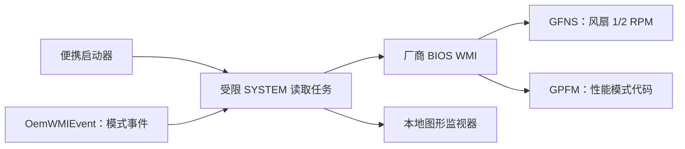

<div align="center">
  
  <h1>MECHREVO WUJIE 14 2026 Fan Monitor</h1>
  <p>机械革命无界 14 2026 风扇转速与性能模式只读监视器</p>
  <p><strong>简体中文</strong> · <a href="README.en.md">English</a></p>
  <p>
    <a href="https://github.com/zsr71/Mechrevo-Wujie14-2026-Fan-Monitor/releases"></a>
    <a href="LICENSE"></a>
    
    
  </p>
</div>

<p align="center">
  
</p>

本项目通过厂商 BIOS WMI 接口读取机械革命 / MECHREVO 无界 14 2026（WUJIE 14 2026）的双风扇实际转速和固件性能模式，不安装 EC 访问驱动，也不修改风扇或性能设置。

> [!IMPORTANT]
> 当前版本是**只读监视器**，不是风扇控制器。它不会设置风扇转速、风扇曲线、性能模式或功耗限制。

## 30 秒了解

| 问题 | 答案 |
|---|---|
| 能看到什么？ | 两把风扇的实时 RPM、当前固件性能模式原始代码和模式切换事件 |
| 需要安装驱动吗？ | 不需要，不使用 PawnIO、WinIO 或 WinRing0 |
| 为什么需要管理员授权？ | 已验证机器只允许 `SYSTEM` 调用厂商 WMI 方法；程序使用受限临时任务读取 |
| 能控制风扇吗？ | 不能，写入接口被明确排除 |
| 支持哪些机器？ | 目前只确认下表中的无界 14 2026 配置 |

**[下载最新公开测试版](https://github.com/zsr71/Mechrevo-Wujie14-2026-Fan-Monitor/releases)** · [提交兼容性报告](https://github.com/zsr71/Mechrevo-Wujie14-2026-Fan-Monitor/issues/new?template=compatibility-report.yml) · [参与项目](CONTRIBUTING.md)

## 兼容性

| 机型 | 主板 | 平台 | BIOS | RPM | 性能模式 | 状态 |
|---|---|---|---|---|---|---|
| MECHREVO 无界 14 2026 | `WUJIE Series-Lark4-LNL` | Intel Lunar Lake | `EM_LNL326_V1.0.19` | 已验证 | 已验证原始代码与事件 | ✅ 实机验证 |
| 其他机型或 BIOS | 未知 | 未知 | 未知 | 未验证 | 未验证 | ⚠️ 不应假定兼容 |

如果你拥有相同或相近机型，欢迎提交经过脱敏的[兼容性报告](https://github.com/zsr71/Mechrevo-Wujie14-2026-Fan-Monitor/issues/new?template=compatibility-report.yml)。程序检测不到对应 WMI 接口时应停止，不应尝试套用其他机型的 EC 地址。

## 工作原理



只有固定的读取请求能到达工作进程；`SPFM`、`FanControl` 和直接 EC 写入均不在执行路径中。

## 功能

- 实时显示两把风扇的实际 RPM，约每秒更新一次。
- 显示 BIOS/EC 当前性能模式代码。
- 被动接收性能模式切换 WMI 事件。
- WMI 事件丢失时，通过只读轮询记录模式变化。
- 不安装 WinIO、PawnIO 或其他第三方内核驱动。
- 不设置风扇转速，不修改风扇模式，不直接写 EC。

## 使用方法

1. 从 GitHub Releases 下载 ZIP。
2. 完整解压到普通本地目录，不要直接在压缩包内运行。
3. 双击 `Fan RPM Monitor.cmd`。
4. 接受一次 Windows 管理员授权。
5. 关闭监视器窗口即可停止读取。

程序会临时建立一个以 `SYSTEM` 身份运行的只读任务，因为本机的厂商 WMI 方法拒绝普通用户调用。窗口关闭后任务会被删除；如果窗口异常终止，心跳超时也会令工作进程停止并自行删除任务。

## 已验证的读取路径

固件在 `root\wmi` 中公开 `OemWMIMethod.OemWMIfun`。程序只发送以下固定请求：

| 功能 | 请求开头 | ACPI 路径 | 行为 |
|---|---|---|---|
| 风扇 1 RPM | `02 01 00` | `WMCD -> GFNS` | 直接读取 `F1RH/F1RL` |
| 风扇 2 RPM | `02 01 01` | `WMCD -> GFNS` | 直接读取 `F2RH/F2RL` |
| 当前性能模式 | `03 09 00` | `WMCD -> GPFM` | 读取 `PPMD` |

转速换算：

```text
RPM = (highByte << 8) | lowByte
```

实机验证结果：

- 风扇 1：`0x0951 = 2385 RPM`
- 风扇 2：`0x0909 = 2313 RPM`

性能模式的设置分支是 `SPFM`，选择码为 `0A`。本项目不包含也不调用该分支。

## 性能模式事件

程序只订阅 `OemWMIEvent`，不会为了订阅事件而调用设置方法。本机 DSDT 显示：

- 事件 `0x41`：`PPMD = 1`
- 事件 `0x42`：`PPMD = 2`

当前先显示原始模式代码，不猜测它们对应的中文名称。需要与本机 Fn 快捷键或原厂屏幕提示对照后再命名。

## 尝试过的路径与结果

| 路径 | 结果 | 结论 |
|---|---|---|
| 原厂控制中心 MQTT 状态主题 | Broker 接受订阅，但不发布 `System/FanInfo` 或 `Fan/Status` | 在当前原厂软件状态下不可用 |
| 原厂 `ACPIDriver` | 设备不存在，事件日志出现初始化失败 | 无法从该服务栈取得可信 RPM |
| 普通用户调用 `OemWMIMethod` | 拒绝访问 | 必须使用受控的 SYSTEM 读取工作进程 |
| PawnIO 直接读取 EC | 风扇明显转动时仍返回 0 | 在该平台上不可信 |
| BIOS WMI `GFNS` | 返回 2385/2313 RPM | 当前唯一实机验证的 RPM 路径 |
| `EmdAcpi_FanControl.GetFanSpeed` | 仅离线分析，未调用 | 名为读取，但内部先写 `XXTT=0x10`，不符合严格只读边界 |
| `EmdAcpi_FanControl.FanControl` | 仅离线分析，未调用 | 明确写入 EC，含义未确认，禁止在主力机测试 |

更详细的风扇控制研究记录见 [FAN_CONTROL_RESEARCH_NOTES.md](FAN_CONTROL_RESEARCH_NOTES.md)。

## 安全边界

工作进程只允许出现以下行为：

- 两个固定的 `GFNS` 请求。
- 一个固定的 `GPFM` 请求。
- 订阅 `OemWMIEvent`。
- 将结果写入程序所在目录的临时 JSON 文件。
- 创建并清理固定名称的临时计划任务。

工作进程中不应出现：

- `SPFM` 或选择码 `0A` 的模式设置请求。
- `FanControl` 调用。
- PawnIO/WinIO/WinRing0 驱动加载。
- 直接 EC 写入。
- 风扇曲线、PWM 或功耗限制设置。

## 项目文件

- `Fan RPM Monitor.cmd`：便携启动器。
- `fan_rpm_monitor.ps1`：管理员授权、临时任务管理和图形界面。
- `fan_rpm_live_worker.ps1`：SYSTEM 上下文中的固定只读 WMI 请求和事件订阅。
- `FAN_CONTROL_RESEARCH_NOTES.md`：未来风扇控制研究记录与风险边界。
- `CONTRIBUTING.md`：兼容性报告、贡献要求和安全边界。
- `scripts/build-release.ps1`：生成 Release ZIP 和 SHA-256 校验文件。

## 隐私与发布说明

公开仓库不包含：

- 本机完整 ACPI 二进制转储。
- `MSDM` Windows OEM 密钥表。
- 本机日志、结果 JSON 或硬件标识转储。
- 机械革命控制中心、驱动或反编译产物。
- ACPICA、iASL、PawnIO 等第三方二进制文件。

这些内容由根目录的白名单式 `.gitignore` 排除。

## 后续方向

- 验证性能模式代码与原厂中文名称的映射。
- 添加已经确认身份和单位的温度传感器。
- 记录温度、RPM 与性能模式的时间序列。
- 增加兼容性检测和 BIOS 版本白名单。
- 将界面重写为签名的原生 Windows 可执行程序。
- 只在非主力测试机上研究 `EmdAcpi_FanControl`，并先证明可靠恢复路径。

## 免责声明

本项目是针对特定机器和 BIOS 的实验性只读工具。不同机型即使 WMI 类名相同，固件实现也可能不同。使用前请核对硬件和 BIOS；作者不保证其他设备兼容。

本项目使用 [MIT License](LICENSE) 开源。风扇与性能模式读取依赖具体机型的固件实现，许可证不构成硬件兼容性或安全保证。
